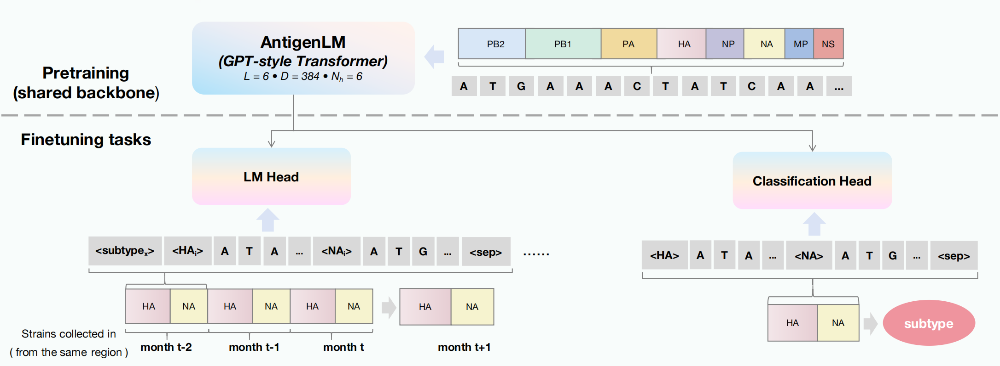

<h3 align="center"><strong>AntigenLM : Structure-Aware DNA Language Modeling for Influenza</strong></h3>

    <a href="">Yue Pei</a>,
    <a href="">Xuebin Chi</a>,
    <a href=""> Yu Kang</a>,
     
    <!-- -->
     
    <b>ICLR 2026</b>

  &nbsp;&nbsp;&nbsp;&nbsp;&nbsp;
  &nbsp;&nbsp;&nbsp;&nbsp;&nbsp;
  

  

## TODOs
- [ ] Clean up code for release
